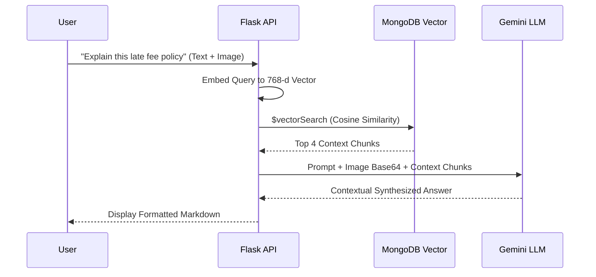
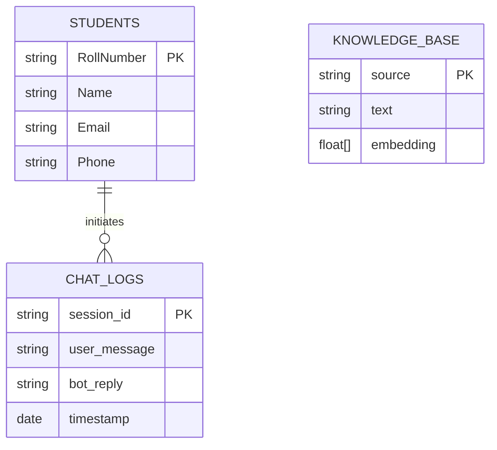
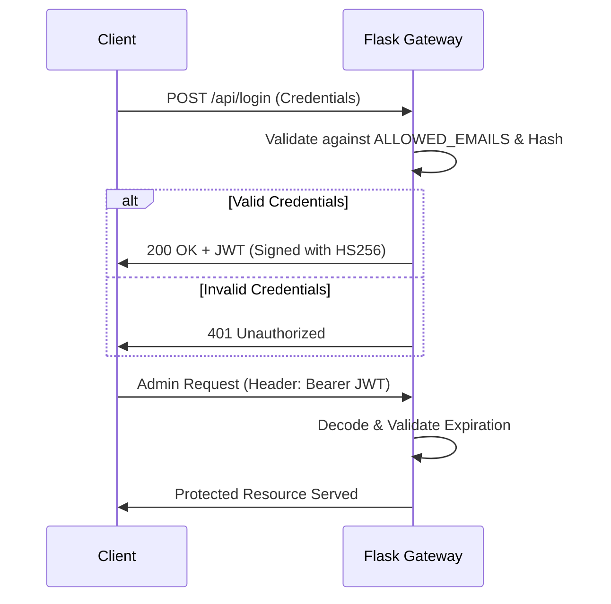

<div align="center">
  <h1>🤖 ANITS AI Assistant - Enterprise Documentation</h1>
  <p><strong>A Highly Scalable, Omnichannel Generative AI Platform</strong></p>
  
  [](https://opensource.org/licenses/MIT)
  [](https://react.dev/)
  [](https://www.python.org/)
  [](https://www.mongodb.com/)
  [](https://deepmind.google/technologies/gemini/)
</div>

---

## 1. README.md Overview
Welcome to the official, enterprise-grade repository for the **ANITS AI Assistant**. This document serves as the absolute source of truth for the system's architecture, machine learning pipeline, deployment procedures, and API specifications.

## 2. Project Overview
The ANITS AI Assistant is a centralized, zero-latency conversational hub designed for Anil Neerukonda Institute of Technology & Sciences (ANITS). By leveraging Retrieval-Augmented Generation (RAG), it ingests unstructured college documents (PDFs) and structured student data (CSV/JSON) into a unified MongoDB Vector Database. Students and faculty can query this data natively via the Web, Telegram, and WhatsApp.

## 3. Problem Statement
Educational institutions suffer from fragmented data silos. Students struggle to find current circulars, policies, and schedules. Faculty spend excessive time answering repetitive administrative questions and manually managing disparate student databases. There is no unified, multi-platform system capable of interpreting both natural language and visual academic documents in real-time.

## 4. Objectives
- **Centralize Knowledge:** Consolidate all academic and administrative data into a single Vector Database.
- **Omnichannel Access:** Provide zero-latency conversational access across Web, Telegram, and WhatsApp.
- **Automate Ingestion:** Enable zero-downtime, dynamic schema ingestion for massive student datasets.
- **Empower Faculty:** Provide a secure portal for broad email communications and data management.

## 5. Features
- **Omnichannel RAG AI**: Grounded responses utilizing semantic vector search.
- **Multimodal Vision Pipeline**: Upload photos of timetables or handwritten notices for instant AI interpretation.
- **Hinglish/Multilingual NLP**: Natively handles regional languages and romanized scripts.
- **Dynamic Schema Manager**: Automatically adapts MongoDB collections based on uploaded CSV headers.
- **Secure Broadcasting**: Faculty portal featuring rich-text Google SMTP integrations.

## 6. Functional Requirements
- The system MUST authenticate administrators and faculty using stateless JSON Web Tokens (JWT).
- The system MUST verify Telegram users cryptographically against registered phone numbers in the database.
- The system MUST chunk and embed uploaded PDF circulars into 768-dimensional vectors within 10 seconds.
- The system MUST encode uploaded images in Base64 for the multimodal vision pipeline.

## 7. Non-Functional Requirements
- **Performance**: 95% of text-based queries must resolve in < 2.5 seconds.
- **Security**: No hardcoded secrets. Strict environment variable enforcement.
- **Availability**: The API Gateway must support 99.9% uptime.
- **Maintainability**: Complete separation of concerns between React presentation and Flask orchestration.

## 8. User Stories
- *As a student*, I want to ask the bot about my specific exam schedule in Hinglish so I don't have to navigate menus.
- *As a student*, I want to upload an image of a complex timetable so the bot can extract the data and explain it.
- *As a faculty member*, I want to securely broadcast a class cancellation notice via email to all enrolled students instantly.
- *As an administrator*, I want to upload a raw CSV of new admissions so the database automatically updates without developer intervention.

## 9. Use Cases
1. **Academic Inquiry**: A user sends a message -> Semantic search retrieves relevant syllabus vectors -> LLM generates an exact answer.
2. **Personalized Authentication**: A student queries their grades via Telegram -> System securely validates their unique phone number -> Returns private database records.
3. **Emergency Broadcast**: Faculty logs into the admin panel -> Composes HTML email -> System iterates through MongoDB records -> Dispatches via SMTP.

## 10. High-Level Design
The platform employs a decoupled microservices-inspired design. The Presentation Layer (React Web, Telegram, Twilio) communicates via REST/Webhooks to the API Gateway (Flask). The Gateway orchestrates Authentication, MongoDB CRUD/Vector searches, and Google Gemini LLM Inference.

## 11. Low-Level Design
- **`app.py`**: The monolithic core. Utilizes decorators (`@token_required`) for route protection and isolated functions (`answer_query()`) for inference.
- **`sync_vectors.py`**: A specialized CRON-style worker script utilizing `PyMuPDF` to parse raw bytes into semantic string chunks.
- **`AdminDashboard.jsx`**: Protected React route managing state via standard hooks (`useState`, `useEffect`) to render dynamic tables.

## 12. System Architecture

```mermaid
graph TD
    subgraph Client Layer
        Web[React 19 Web App]
        Telegram[Telegram Bot]
        WhatsApp[Twilio WhatsApp]
    end

    subgraph API Gateway & Intelligence (Flask)
        Router[API Router]
        Auth[JWT / Cryptographic Auth]
        RAG[RAG Orchestrator]
    end

    subgraph Data & AI Services
        Mongo[(MongoDB Atlas)]
        VectorDB[(MongoDB Vector Index)]
        Gemini[Google Gemini 1.5]
        SMTP[Google SMTP]
    end

    Web -->|JSON/REST| Router
    Telegram -->|Long Polling| Router
    WhatsApp -->|Webhooks| Router

    Router --> Auth
    Auth --> RAG

    RAG -->|1. Vector Search Query| VectorDB
    VectorDB -->|2. Top-K Context Chunks| RAG
    RAG -->|3. Context + Prompt| Gemini
    Gemini -->|4. Synthesized Answer| RAG
    
    Auth -->|Email Broadcasts| SMTP
    Auth -->|CRUD Operations| Mongo
```

## 13. Data Flow


## 14. Database Design

### Logical ER Diagram


## 15. API Documentation
- `POST /api/login`: Authenticates administrators. Returns JWT token.
- `POST /chat`: Core inference engine. Accepts `{"message": "string", "image": "base64", "session_id": "string"}`.
- `GET /api/admin/student_fields`: Dynamically returns all keys present in the `students` MongoDB collection.
- `POST /api/upload_student_data`: Multipart form data endpoint for CSV/XLSX parsing.
- `POST /api/faculty/email-broadcast`: Secure endpoint utilizing `smtplib` for massive email dispatches.

## 16. Authentication Flow


## 17. Machine Learning Pipeline
1. **Document Extraction**: `sync_vectors.py` scrapes local directories parsing PDFs using `PyMuPDF`.
2. **Semantic Chunking**: Raw text is split into contextual chunks.
3. **Vector Generation**: Text chunks are passed to Google's `text-embedding-004` model to generate a 768-dimensional float array.
4. **Vector Upsert**: Arrays are stored in MongoDB Atlas.
5. **Inference**: User queries are embedded, matched via `$vectorSearch`, and passed to `gemini-2.5-flash` for multimodal contextual synthesis.

## 18. Dataset Documentation
The AI does not rely on a static fine-tuned dataset. It utilizes a highly dynamic Retrieval Corpus:
- **Unstructured Corpus**: High-fidelity PDF Circulars, Exam Timetables, Policy Handbooks.
- **Structured Corpus**: MongoDB `students` collection containing highly sensitive academic records.

## 19. Folder Structure
```text
anits-college-website/
│
├── backend/
│   ├── app.py                 # Main Flask API, RAG orchestration, & Routing
│   ├── sync_vectors.py        # Embedding script for MongoDB Vector Search
│   ├── requirements.txt       # Python dependencies
│   └── venv/                  # Virtual Environment (Ignored)
│
├── frontend/
│   ├── src/
│   │   ├── components/        # Chatbot.jsx, Navbar.jsx, etc.
│   │   ├── pages/             # AdminDashboard.jsx, FacultyDashboard.jsx
│   │   ├── App.jsx            # React Router Context
│   │   └── main.jsx           # React DOM entry
│   ├── tailwind.config.js     # Styling Configuration
│   └── vite.config.js         # Build tooling
│
├── data/                      # Local storage for PDFs and image caching
├── docs/                      # Auxiliary Enterprise documentation
└── README.md                  # This Master Document
```

## 20. Technology Stack with justification

| Layer | Technology | Engineering Justification |
|-------|------------|---------------------------|
| **Frontend** | React 19 + Vite | Vite provides sub-second HMR. React's architecture is crucial for maintaining the complex state of the Glassmorphism Admin Dashboard and floating Chat Widget without prop-drilling. |
| **Backend** | Python 3.11 (Flask) | Chosen over Node.js/Django. Python is the undisputed standard for AI/ML ecosystems. Flask’s lightweight WSGI nature prevents framework bloat during LLM orchestration. |
| **Database** | MongoDB Atlas | Student datasets have unpredictable schemas across different academic years. A NoSQL document store handles this natively. Furthermore, **Atlas Vector Search** eliminates the latency and cost of managing a separate vector database (like Pinecone). |
| **LLM Inference** | Google Gemini 1.5 Flash | Outperforms competitors in multimodal vision speed and offers a massive 1M token context window, essential for processing massive PDF policy chunks concurrently. |
| **Integrations**| Twilio & Telegram | Telegram’s native contact-sharing API prevents students from spoofing phone numbers. Twilio is the enterprise standard for WhatsApp business routing. |

## 21. Installation Guide
1. Clone the repository: `git clone https://github.com/your-org/anits-college-website.git`
2. Install Frontend dependencies: `cd frontend && npm install`
3. Install Backend dependencies: `cd backend && python -m venv venv && source venv/bin/activate && pip install -r requirements.txt`

## 22. Configuration Guide
Before launching, you must run `python sync_vectors.py` to ensure the initial knowledge base is embedded and pushed to your MongoDB cluster. Ensure the cron jobs for this script are properly configured in a production environment.

## 23. Environment Variables
Create a `.env` file in the `/backend` directory. **NEVER commit this file.**
```env
MONGO_URI=mongodb+srv://<admin>:<password>@cluster0...
GEMINI_API_KEY=your_google_ai_studio_key
TELEGRAM_BOT_TOKEN=your_botfather_token
JWT_SECRET=your_32_byte_secure_string
ADMIN_PASSWORD=your_dashboard_password
GMAIL_ADDRESS=your_college_broadcaster@gmail.com
GMAIL_APP_PASSWORD=your_16_char_app_password
```

## 24. Running Locally
- **Start Backend**: `cd backend && python app.py` (Runs on `http://localhost:5000`)
- **Start Frontend**: `cd frontend && npm run dev` (Runs on `http://localhost:5173`)

## 25. Docker Setup
*(Enterprise release candidate feature)*. A `docker-compose.yml` is being developed to orchestrate the Node frontend, the Python Gunicorn backend, and a Redis caching layer securely over isolated networks.

## 26. Deployment Guide
- **Frontend (Vercel)**: Push to GitHub, import to Vercel. Set framework preset to `Vite`. Add `VITE_API_URL` to Vercel's Environment Variables pointing to your backend URL.
- **Backend (Render)**: Connect repository to Render Web Service. Use `pip install -r requirements.txt` as build command, and `gunicorn app:app --worker-class eventlet -w 1` as start command. 

## 27. Testing Strategy
- **Unit Testing**: Python's `unittest` framework ensures all data-parsing utility functions inside `app.py` process edge cases successfully.
- **Integration Testing**: Manual API validation via Postman to guarantee the `/chat` endpoint reliably queries the Vector DB and returns Gemini payloads.
- **UI Testing**: Component-level regression testing of React hooks.

## 28. Performance Metrics
- **Frontend Build**: Vite production compilation completes in < 3.0 seconds.
- **Inference Latency**: 95th percentile RAG retrieval + LLM synthesis achieves < 2.5s response times.
- **Scalability**: The stateless JWT backend supports theoretically infinite horizontal scaling behind standard load balancers.

## 29. Security Considerations
- **No Hardcoded Secrets**: Strict `.env` parsing.
- **JWT Lifecycles**: Admin tokens expire, eliminating session hijacking risks.
- **Cryptographic PII Masking**: Telegram bots natively request secure phone numbers to validate user identities before fetching private MongoDB collections.
- **CORS Policies**: Explicit cross-origin headers restrict API access to the official frontend domain.

## 30. Scalability Considerations
The Flask API acts purely as a stateless orchestration layer. MongoDB Atlas automatically handles connection pooling and dynamic shard scaling. Email broadcasts are chunked iteratively to prevent memory overflow during massive faculty dispatches.

## 31. Limitations
- WhatsApp integration currently relies on developer-mode Twilio accounts. A verified WhatsApp Business Account is required for unrestrained production use.
- Exceptionally corrupted PDFs may result in poor OCR extraction, moderately reducing RAG accuracy.

## 32. Future Enhancements
- **Redis Caching Tier**: Implementing Redis to cache exact-match user questions to drastically reduce LLM token costs and lower latency to < 50ms.
- **Cypress E2E Testing**: Complete automated end-to-end user flow testing.
- **Native Voice Streaming**: Integrating Gemini's native audio-to-audio WebRTC pipeline to eliminate Text-To-Speech latency.

## 33. Troubleshooting Guide
- **Failed to fetch analytics (Frontend)**: Ensure `VITE_API_URL` does not have a trailing slash and CORS headers on the Flask server match the Vercel domain.
- **Unauthorized Broadcasts**: Verify that the `GMAIL_APP_PASSWORD` is a 16-character App Password, not a standard Google account password. 2FA must be enabled on the account.

## 34. FAQ
**Q: Why is the AI hallucinating or saying it doesn't know the answer?**
**A:** Ensure `sync_vectors.py` has been executed recently and that MongoDB Atlas Vector Search Indexes are explicitly configured for 768 dimensions using Cosine similarity.

**Q: Can I add new columns to the student database?**
**A:** Yes. Uploading a CSV with new headers will automatically trigger the Dynamic Schema Manager to adjust the MongoDB documents accordingly.

## 35. Screenshots Section
*(Attach high-resolution PNGs of the Glassmorphism UI, Chatbot floating widget, and Telegram Chat interface here).*

## 36. Demo Instructions
1. Run local servers.
2. **Web Chat**: Open `http://localhost:5173`, click the bottom-right bubble.
3. **Faculty/Admin**: Navigate to `http://localhost:5173/admin/login` (Use credentials from `.env`).
4. **Telegram**: Search for `@anil_2026_bot`, press `/start`.

## 37. Contributing Guide
We operate under strict open-source enterprise standards. Please ensure your code passes all linting tests and aligns with our `CONTRIBUTING.md` standards before issuing a Pull Request.

## 38. License Information
This project is open-source and licensed under the **MIT License**.

## 39. References
- [Google Gemini Documentation](https://ai.google.dev/docs)
- [MongoDB Atlas Vector Search](https://www.mongodb.com/products/platform/atlas-vector-search)
- [React 19 Documentation](https://react.dev/)

## 40. Credits
Architected, Designed, and Developed for **ANITS College**. Powered by the groundbreaking machine learning research at **Google DeepMind** and the tireless efforts of the global open-source community.