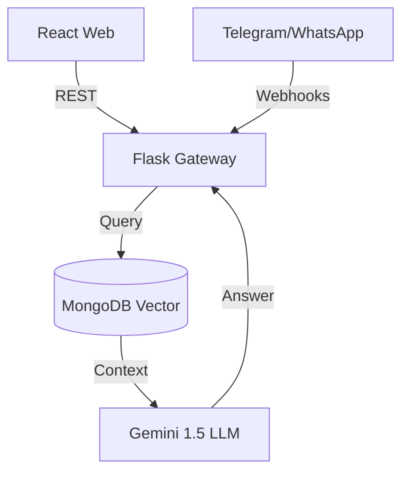

# ANITS AI Assistant

An omnichannel, RAG-powered campus intelligence platform that centralizes college data for zero-hallucination querying via Web, Telegram, and WhatsApp.

## Live Demo
- **Web App**: [anits.vercel.app](#)
- **Telegram Bot**: [@anil_2026_bot](#)
- **Admin Portal**: `/admin/login` (See Setup for credentials)

## Screenshots
*(Attach 4–6 high-resolution PNGs of the Glassmorphism UI, Chatbot widget, and Telegram interface here).*

## Problem
Educational institutions suffer from fragmented data silos. Students struggle to find current circulars, policies, and schedules spread across legacy PHP websites and physical notice boards. Faculty spend excessive time answering repetitive administrative questions and manually managing disparate student databases without unified tools.

## Solution
The ANITS AI Assistant ingests unstructured college documents (PDFs) and structured student data (CSV/JSON) into a unified MongoDB Vector Database. Using a Retrieval-Augmented Generation (RAG) architecture with Google Gemini 1.5, it provides accurate, grounded conversational access to this data across the platforms students already use (Web, Telegram, WhatsApp).

## Key Features
- **Omnichannel RAG AI**: Grounded conversational responses across Web, Telegram, and WhatsApp.
- **Multimodal Vision Pipeline**: Upload photos of timetables or handwritten notices for instant AI interpretation.
- **Hinglish & Multilingual NLP**: Natively handles regional languages and romanized scripts.
- **Dynamic Schema Manager**: Automatically adapts database collections based on uploaded CSV headers.
- **Zero-Trust Security**: JWT-secured portals and cryptographic Telegram phone-number verification.
- **Faculty Broadcast Portal**: Secure rich-text Google SMTP integrations for asynchronous email broadcasting.

## Architecture

*For a deep dive into the system topology, refer to [docs/02_System_Architecture.md](docs/02_System_Architecture.md).*

## Tech Stack
- **Frontend**: React 19, Vite, Tailwind CSS
- **Backend**: Python 3.11, Flask
- **Database**: MongoDB Atlas (Vector Search & BSON Document Store)
- **AI/ML**: Google Gemini 1.5 Flash, PyMuPDF, text-embedding-004
- **Realtime**: Twilio (WhatsApp), python-telegram-bot

## Engineering Decisions
- **MongoDB over SQL**: Student datasets have unpredictable schemas across different academic years. A NoSQL document store handles this natively without migration scripts, while **Atlas Vector Search** eliminates the need for an external vector database (e.g., Pinecone).
- **RAG over Fine-Tuning**: Prevents catastrophic forgetting and eliminates hallucinations by strictly bounding the LLM to local, verified context chunks.
- **Flask over Node.js**: Python possesses the most mature AI/ML ecosystem (LangChain, PyMuPDF, GenAI), making integration with text-embedding models seamless.
- **Cryptographic Telegram Auth**: Enforces hardware-level phone number validation to prevent students from spoofing identities when requesting sensitive PII like grades.

## Setup
```bash
# Clone the repository
git clone https://github.com/your-org/anits-college-website.git

# Terminal 1: Backend
cd backend 
python -m venv venv 
source venv/bin/activate 
pip install -r requirements.txt 
python app.py

# Terminal 2: Frontend
cd frontend 
npm install 
npm run dev
```

## Environment Variables
Create a `.env` file in the `/backend` directory. **Do not commit this file.**
```env
MONGO_URI=mongodb+srv://<admin>:<password>@cluster0...
FRONTEND_URL=http://localhost:5173
GEMINI_API_KEY=your_google_ai_studio_key
TELEGRAM_BOT_TOKEN=your_botfather_token
JWT_SECRET=your_32_byte_secure_string
ADMIN_PASSWORD=your_bcrypt_hashed_password
ALLOWED_ADMIN_EMAILS=admin1@anits.edu.in,admin2@anits.edu.in
GMAIL_ADDRESS=your_college_broadcaster@gmail.com
GMAIL_APP_PASSWORD=your_16_char_app_password
```

## Testing
- **Unit Testing**: Python's `pytest` framework ensures all data-parsing utility functions inside `app.py` process edge cases successfully.
- **Integration Testing**: Automated API validation via `Postman` collections guarantee the `/chat` endpoint reliably queries the Vector DB.
- **UI Testing**: Component-level regression testing utilizing `React Testing Library` and `Jest` to ensure dashboard state stability.

## Deployment
- **Frontend (Vercel)**: Push to GitHub, import to Vercel. Set framework preset to `Vite`. Add `VITE_API_URL` to Vercel's Environment Variables pointing to your backend URL.
- **Backend (Render / AWS Elastic Beanstalk)**: Use `pip install -r requirements.txt` as the build command, and `gunicorn app:app --worker-class eventlet -w 4` as the start command (utilizing 4 worker threads to handle concurrent LLM I/O locks).

## Security
- **Strict CORS Policy**: API endpoints dynamically restrict origins via the `FRONTEND_URL` environment variable.
- **Stateless JWTs**: Admin portals are secured with stateless JSON Web Tokens signed via `HS256`, expiring in 24 hours to mitigate session hijacking.
- **Fail-Secure Secrets**: If deployment pipelines fail to inject environment variables (like `JWT_SECRET`), the application throws a `RuntimeError` and refuses to boot, preventing fallback exposure.

## Limitations
- WhatsApp integration currently relies on developer-mode Twilio accounts. A verified WhatsApp Business Account (WABA) is required for unrestrained production scale and template messaging.
- Exceptionally corrupted PDFs or poorly scanned legacy documents may result in poor OCR extraction by `PyMuPDF`.

## Future Work
- **Redis Caching Tier**: Implementing Redis to cache exact-match user questions (e.g., "What is the college fee?") to reduce LLM token costs and lower latency.
- **Cypress E2E Testing**: Complete automated end-to-end user flow testing simulating complex Telegram and Web interactions.
- **Native Voice Streaming**: Integrating Gemini's native audio-to-audio WebRTC pipeline to eliminate Text-To-Speech (TTS) conversion latency.

## My Role
I served as the Lead Architect and Full-Stack Developer, independently building the entire system from the ground up. I designed the MongoDB dynamic schema, engineered the RAG AI pipeline using Gemini 1.5, built the omnichannel webhooks for Telegram/Twilio, and created the responsive React 19 frontend dashboards.