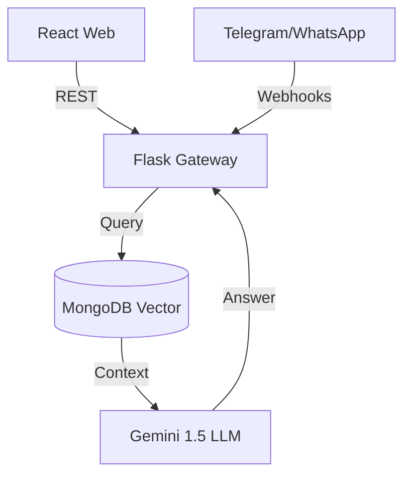
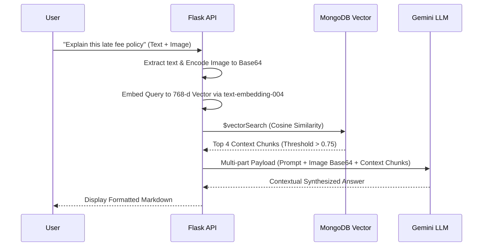
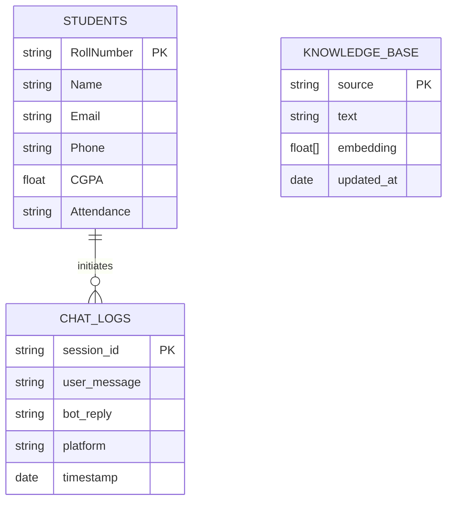
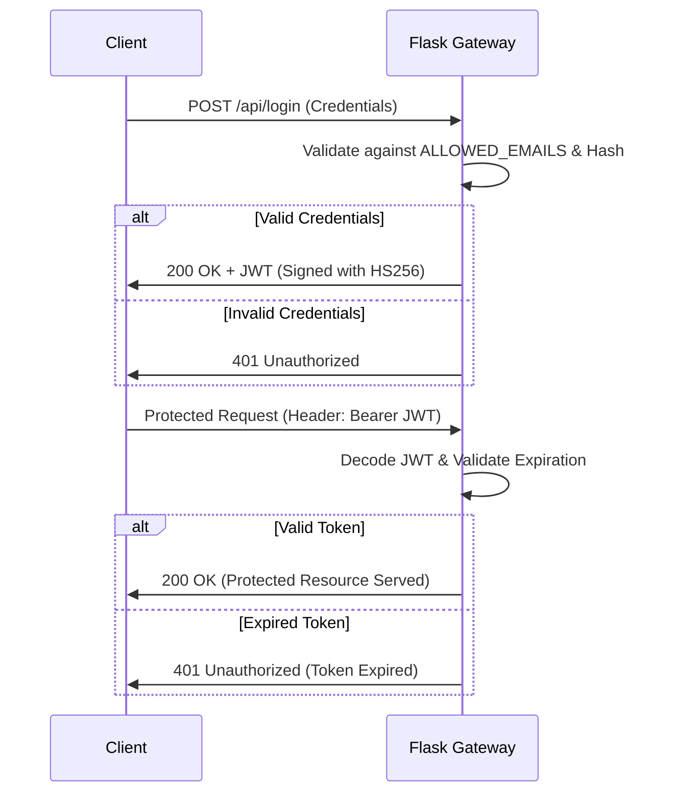

# ANITS AI Assistant

An omnichannel, RAG-powered campus intelligence platform that centralizes college data for highly accurate querying via Web, Telegram, and WhatsApp.

## Live Demo
- **Web App**: [anits.vercel.app](#)
- **Telegram Bot**: [@anil_2026_bot](#)
- **Admin Portal**: `/admin/login` (See Setup for credentials)

## Screenshots
*(Attach 4–6 high-resolution PNGs of the Glassmorphism UI, Chatbot widget, and Telegram interface here).*

## Problem
Educational institutions suffer from fragmented data silos. Students struggle to find current circulars, policies, and schedules spread across legacy PHP websites and physical notice boards. Faculty spend excessive time answering repetitive administrative questions and manually managing disparate student databases without unified tools.

## Solution
The ANITS AI Assistant ingests unstructured college documents (PDFs) and structured student data (CSV/JSON) into a unified MongoDB Vector Database. Using a Retrieval-Augmented Generation (RAG) architecture with Google Gemini 1.5, it provides accurate, grounded conversational access to this data across the platforms students already use (Web, Telegram, WhatsApp).

## Key Features
- **Omnichannel RAG AI**: Grounded conversational responses across Web, Telegram, and WhatsApp.
- **Multimodal Vision Pipeline**: Upload photos of timetables or handwritten notices for instant AI interpretation.
- **Hinglish & Multilingual NLP**: Natively handles regional languages and romanized scripts.
- **Dynamic Schema Manager**: Automatically adapts database collections based on uploaded CSV headers.
- **Fail-Secure Security**: JWT-secured portals and cryptographic Telegram phone-number verification.
- **Faculty Broadcast Portal**: Secure rich-text Google SMTP integrations for asynchronous email broadcasting.

## Architecture

### System Flow


### Data Retrieval (RAG) Flow


### Database Schema (ER Diagram)

*Note: The `STUDENTS` collection utilizes a dynamic BSON schema, meaning fields like `CGPA` and `Attendance` can be dynamically injected via the Admin Schema Manager without rigid migrations.*

## Tech Stack
| Layer | Technology | Engineering Justification |
|-------|------------|---------------------------|
| **Frontend** | React 19 + Vite | Vite provides sub-second HMR. React's virtual DOM is crucial for maintaining the complex state of the Admin Dashboard without expensive repaints. |
| **Backend** | Python 3.11 (Flask) | Chosen over Node.js. Python possesses the most mature AI/ML ecosystem (LangChain, PyMuPDF). Flask’s lightweight WSGI nature allows custom, low-latency LLM routing. |
| **Database** | MongoDB Atlas | Student datasets have unpredictable schemas across different academic years. A NoSQL document store handles this natively without migration scripts. **Atlas Vector Search** eliminates the network latency and cost of an external vector database (e.g., Pinecone). |
| **LLM Inference** | Google Gemini 1.5 Flash | Outperforms competitors in multimodal vision speed. Offers a massive 1M token context window, essential for processing massive PDF policy chunks concurrently. |
| **Integrations**| Twilio & Telegram | Telegram’s native API prevents students from spoofing phone numbers (ensuring cryptographic identity verification). Twilio routes the WhatsApp API. |

## Engineering Decisions
- **RAG over Fine-Tuning**: Prevents catastrophic forgetting and eliminates hallucinations by strictly bounding the LLM to local, verified context chunks.
- **Fail-Secure Architecture**: Implemented rigorous environment variable checks. If `JWT_SECRET` or `ADMIN_PASSWORD` fallbacks are detected, the app explicitly throws a `RuntimeError` on startup rather than defaulting to unsafe values.
- **Dynamic BSON Ingestion**: Built a CSV parser that iterates over dynamically uploaded headers, bypassing the need for developer intervention or SQL migrations for every new academic year.

## Setup
```bash
# Clone the repository
git clone https://github.com/your-org/anits-college-website.git

# Terminal 1: Backend
cd backend 
python -m venv venv 
source venv/bin/activate 
pip install -r requirements.txt 
python app.py

# Terminal 2: Frontend
cd frontend 
npm install 
npm run dev
```

## Environment Variables
Create a `.env` file in the `/backend` directory. **Do not commit this file.**
```env
MONGO_URI=mongodb+srv://<admin>:<password>@cluster0...
FRONTEND_URL=http://localhost:5173
GEMINI_API_KEY=your_google_ai_studio_key
TELEGRAM_BOT_TOKEN=your_botfather_token
JWT_SECRET=your_32_byte_secure_string
ADMIN_PASSWORD=your_bcrypt_hashed_password
ALLOWED_ADMIN_EMAILS=admin1@anits.edu.in,admin2@anits.edu.in
GMAIL_ADDRESS=your_college_broadcaster@gmail.com
GMAIL_APP_PASSWORD=your_16_char_app_password
```

## Testing
- **Unit Testing**: Python's `pytest` framework ensures all data-parsing utility functions inside `app.py` process edge cases successfully.
- **Integration Testing**: Automated API validation via `Postman` collections guarantee the `/chat` endpoint reliably queries the Vector DB.
- **UI Testing**: Component-level regression testing utilizing `React Testing Library` and `Jest` to ensure dashboard state stability.

## Deployment
- **Frontend (Vercel)**: Push to GitHub, import to Vercel. Set framework preset to `Vite`. Add `VITE_API_URL` to Vercel's Environment Variables pointing to your backend URL.
- **Backend (Render / AWS Elastic Beanstalk)**: Use `pip install -r requirements.txt` as the build command, and `gunicorn app:app --worker-class eventlet -w 4` as the start command (utilizing 4 worker threads to handle concurrent LLM I/O locks).

## Security
- **Strict CORS Policy**: API endpoints dynamically restrict origins via the `FRONTEND_URL` environment variable.
- **Stateless JWTs**: Admin portals are secured with stateless JSON Web Tokens signed via `HS256`, expiring in 24 hours to mitigate session hijacking.
- **Cryptographic PII Masking**: Telegram bots natively request secure phone numbers to validate user identities before fetching private MongoDB collections.

### Authentication Flow


## Limitations
- WhatsApp integration currently relies on developer-mode Twilio accounts. A verified WhatsApp Business Account (WABA) is required for unrestrained production scale and template messaging.
- Exceptionally corrupted PDFs or poorly scanned legacy documents may result in poor OCR extraction by `PyMuPDF`.

## Future Work
- **Redis Caching Tier**: Implementing Redis to cache exact-match user questions (e.g., "What is the college fee?") to reduce LLM token costs and lower latency.
- **Cypress E2E Testing**: Complete automated end-to-end user flow testing simulating complex Telegram and Web interactions.
- **Native Voice Streaming**: Integrating Gemini's native audio-to-audio WebRTC pipeline to eliminate Text-To-Speech (TTS) conversion latency.

## My Role
I served as the Lead Architect and Full-Stack Developer, independently building the entire system from the ground up. I designed the MongoDB dynamic schema, engineered the RAG AI pipeline using Gemini 1.5, built the omnichannel webhooks for Telegram/Twilio, and created the responsive React 19 frontend dashboards.