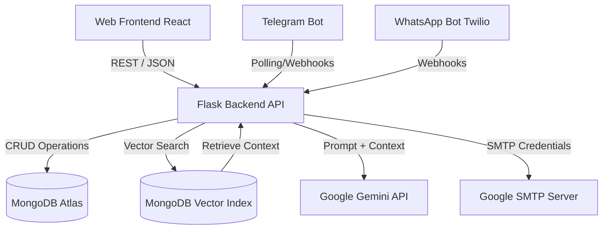
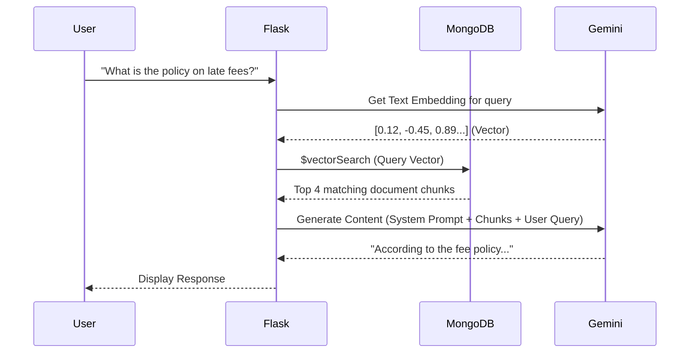

# 02 - System Architecture

## 1. High-Level Design (HLD)

The ANITS AI Assistant follows a modern decoupled architecture. It separates the presentation layer (React) from the logic and intelligence layer (Flask + Gemini), with a robust NoSQL data tier (MongoDB).

## 2. Low-Level Design (LLD)

### Backend Components
- **`app.py`**: The monolithic core. Handles routing, authentication middlewares, LLM orchestration, and integrations.
- **`sync_vectors.py`**: A specialized CRON-style worker script. It scans local data directories (PDFs, JSONs), chunks the text, calls the Gemini Embedding model, and upserts the vectors into MongoDB.
- **Authentication**: JWT-based stateless authentication for the web dashboard. Telegram uses cryptographic phone number validation mapping to `student_id`.

### Frontend Components
- **`AdminDashboard.jsx`**: Protected route rendering complex data tables, upload zones, and analytics charts.
- **`Chatbot.jsx`**: An interactive, floating UI widget. Handles WebRTC audio recording, Base64 image encoding, and Markdown rendering.
- **`FacultyDashboard.jsx`**: Protected route for broadcast functionality.

## 3. Data Flow

### The RAG (Retrieval-Augmented Generation) Data Flow

## 4. Architectural Decisions & Justifications

| Decision | Technology Chosen | Justification |
|----------|-------------------|---------------|
| **Backend Framework** | Python (Flask) | Python is the undisputed king of AI/ML ecosystems. Flask was chosen over Django/FastAPI for its lightweight nature, allowing rapid prototyping of LLM integrations without opinionated overhead. |
| **Frontend Framework** | React (Vite) | Vite provides unparalleled HMR (Hot Module Replacement) speeds. React offers a massive component ecosystem, making the complex Chat Widget and Admin Dashboard modular and maintainable. |
| **Database** | MongoDB Atlas | Student data is notoriously unstructured (different batches have different columns). A NoSQL document store perfectly handles this. Additionally, Atlas offers native `$vectorSearch`, eliminating the need for a separate vector database like Pinecone. |
| **LLM Provider** | Google Gemini (1.5 Pro/Flash) | Gemini 1.5 Flash offers industry-leading speed for real-time chat and native multimodal (vision/audio) capabilities, outperforming GPT-4o-mini in contextual window size (1M tokens). |
