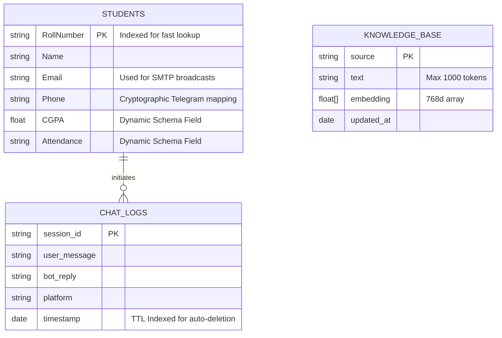

# 02 - System Architecture & Data Topology

## 10. High-Level Design (HLD)
The ANITS AI Assistant implements a strictly decoupled, microservices-inspired topology. 
1. **Presentation Layer**: Consists of the React 19 Single Page Application (SPA), Telegram long-polling clients, and Twilio webhooks. This layer is entirely stateless.
2. **API Gateway Layer**: A Flask WSGI application deployed on Render/AWS. It acts as the central router, handling Rate Limiting, RBAC (JWT validation), and payload sanitization.
3. **Intelligence Layer**: The synchronous boundary where Flask communicates over HTTPS with the Google Gemini REST APIs for both embeddings (`text-embedding-004`) and synthesis (`gemini-1.5-flash`).
4. **Persistence Layer**: MongoDB Atlas, housing both unstructured vector embeddings (via HNSW indexes) and structured BSON documents for student PII.

## 11. Low-Level Design (LLD)
### Frontend State Management (React)
- **Custom Hooks**: Abstraction of complex fetch logic (e.g., `useChat()`, `useAuth()`).
- **Context API**: Global state management for JWTs, ensuring prop-drilling is completely eliminated.
- **Base64 Encoding**: Native `FileReader` APIs in the browser convert images to Base64 strings immediately before transmission to avoid large multipart/form-data overheads on the `/chat` endpoint.

### Backend Orchestration (Flask)
- **`app.py` Lifecycle**: Initializes `PyMongo` client securely using `MONGO_URI`. Wraps critical routes in a `@token_required` decorator which uses `jwt.decode` with the `HS256` algorithm.
- **RAG Assembly**: The `answer_query(message, session_id, image_base64)` function acts as a Facade. It conditionally branches based on the presence of an image, fetches exactly 4 context chunks via `$vectorSearch`, and formats a strict system prompt instructing the LLM to only answer based on the provided context.

## 12. System Architecture

```mermaid
graph TD
    subgraph Client Layer
        Web[React 19 Vite Client]
        Telegram[Telegram Native Bot]
        WhatsApp[Twilio Webhook]
    end

    subgraph API Gateway & Intelligence (Flask WSGI)
        Router[Flask Endpoint Router]
        Auth[JWT / Cryptographic Auth Interceptor]
        RAG[RAG Semantic Orchestrator]
    end

    subgraph Data & AI Services
        Mongo[(MongoDB Atlas BSON)]
        VectorDB[(MongoDB HNSW Vector Index)]
        Gemini[Google Gemini 1.5 LLM]
        SMTP[Google SMTP / TLS]
    end

    Web -->|JSON over HTTPS| Router
    Telegram -->|Long Polling Thread| Router
    WhatsApp -->|POST Webhooks| Router

    Router --> Auth
    Auth --> RAG

    RAG -->|1. Vector Search Query| VectorDB
    VectorDB -->|2. Top-K Context Chunks| RAG
    RAG -->|3. Context + Prompt| Gemini
    Gemini -->|4. Synthesized Answer| RAG
    
    Auth -->|Email Broadcasts| SMTP
    Auth -->|CRUD Operations| Mongo
```

## 13. Data Flow
1. **Ingestion Flow (Offline)**: 
   - `sync_vectors.py` scans `/data/`. 
   - `PyMuPDF` extracts text. 
   - Text is split into `1000-token` chunks with `150-token` overlaps. 
   - Google API returns `768-dimensional` embeddings. 
   - Upserted into `knowledge_base` MongoDB collection.
2. **Inference Flow (Online)**:
   - Client sends JSON payload: `{"message": "Query", "image_base64": "..."}`.
   - API Gateway computes vector embedding of the raw text query.
   - Atlas `$vectorSearch` performs an HNSW K-Nearest Neighbors (KNN) search utilizing Cosine Similarity, returning chunks exceeding a `0.75` similarity threshold.
   - LLM receives a structured prompt containing the system instructions, the Base64 image payload (if any), and the retrieved text chunks.

## 14. Database Design

### MongoDB Logical Architecture
MongoDB was specifically chosen to handle the highly polymorphic nature of academic data. Unlike SQL, which requires rigid `ALTER TABLE` migrations for every new curriculum change, MongoDB allows seamless BSON injection.

- **`students` Collection**: 
  - Dynamic schema. Guaranteed fields: `Roll Number` (Primary Key), `Name`, `Phone`, `Email`. 
  - Variable fields dynamically parsed from CSVs: `CGPA`, `Attendance`, `Fee Deficits`, `Placement Status`.
- **`chat_logs` Collection**: 
  - Stores `session_id` to maintain historical context windows. 
  - Fields: `user_message`, `bot_reply`, `timestamp`, `platform` (web/telegram).
- **`knowledge_base` Collection**: 
  - Dedicated Vector store.
  - Fields: `text` (The semantic chunk), `embedding` (The 768-dimensional float array), `source` (Filename for citation tracing).

### Entity-Relationship (ER) Diagram

