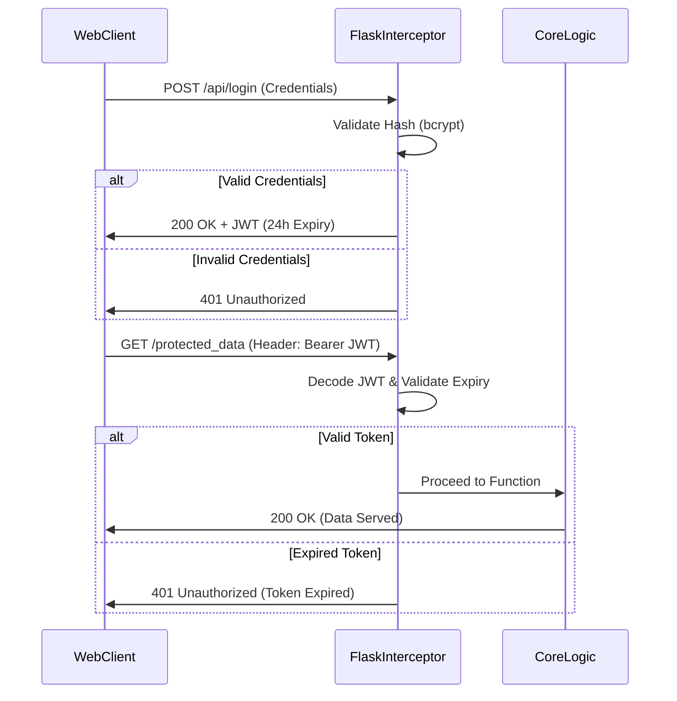

# 03 - API Contracts & Authentication Topology

## 15. API Documentation

The RESTful API adheres to strict JSON payload contracts. All protected endpoints validate the `Authorization: Bearer <token>` header natively in Flask middleware.

### 15.1. Authentication
`POST /api/login`
Authenticates high-level administrative users.
- **Headers**: `Content-Type: application/json`
- **Request Body**:
```json
{
  "email": "admin@anits.edu.in",
  "password": "secure_bcrypt_hashed_string"
}
```
- **Response (200 OK)**:
```json
{
  "token": "eyJhbGciOiJIUzI1NiIsInR5cCI6IkpXVCJ9..."
}
```
- **Response (401 Unauthorized)**:
```json
{
  "error": "Invalid credentials"
}
```

### 15.2. AI Inference Engine
`POST /chat`
The core gateway for LLM evaluation. Accepts standard text and massive Base64 payloads simultaneously.
- **Headers**: `Content-Type: application/json`
- **Request Body**: 
```json
{
  "message": "Explain the discrepancy in my attendance.",
  "image_base64": "data:image/jpeg;base64,/9j/4AAQSkZJRgABAQAAAQABAAD/2wCE...",
  "session_id": "web_a1b2c3d4e5"
}
```
- **Response (200 OK)**:
```json
{
  "reply": "According to the uploaded timetable and the policy manual, your attendance falls below the 75% threshold."
}
```
*(Rate limiting applies: 55 requests / minute per IP).*

### 15.3. Dynamic Schema Retrieval
`GET /api/admin/student_fields`
Reads the first 50 BSON documents in the `students` collection, aggregates all unique top-level keys, and returns them to populate the React frontend's table headers dynamically.
- **Headers**: `Authorization: Bearer <token>`
- **Response (200 OK)**:
```json
[
  "Roll Number", 
  "Name", 
  "Branch", 
  "Phone", 
  "CGPA",
  "Placement Status" 
]
```

### 15.4. Batch Ingestion
`POST /api/upload_student_data`
- **Headers**: `Authorization: Bearer <token>`, `Content-Type: multipart/form-data`
- **Payload**: `file` (Buffer of .csv or .xlsx)
- **Response (200 OK)**: `{"message": "Successfully upserted 1250 records without schema violations."}`

## 16. Authentication Flow

Security is heavily enforced. State is never maintained on the server (stateless architecture) to ensure seamless horizontal scaling.

### Web JWT Flow (Admin/Faculty)
1. The client submits plain-text credentials over HTTPS.
2. The Flask gateway compares the hashed password against the environment variable utilizing `werkzeug.security.check_password_hash`.
3. If valid, the gateway issues a JSON Web Token (JWT) signed with the highly secure `HS256` symmetric algorithm, utilizing a 32-byte secret injected via `os.getenv('JWT_SECRET')`.
4. The token is injected with an `exp` claim of 24 hours.
5. All subsequent requests are intercepted by the `@token_required` wrapper, which halts execution if a `jwt.ExpiredSignatureError` or `jwt.InvalidTokenError` is thrown.



### Telegram Cryptographic Identity Flow (Students)
Unlike traditional portals requiring passwords (which students often forget), the Telegram bot relies on hardware/account-level cryptographic guarantees provided by the Telegram API.
1. The student clicks `/start`.
2. The bot utilizes a `ReplyKeyboardMarkup` prompting the user to share their native `Contact` object. (Users cannot type a fake number; they MUST share their cryptographically signed account number).
3. The Flask webhook receives the `contact.phone_number`.
4. Flask normalizes the string (stripping country codes) and queries the MongoDB `students` collection.
5. If a match is found, the user's `telegram_id` is permanently linked to their `Roll Number` in the database, allowing them to query sensitive PII (like CGPA) securely thereafter.
