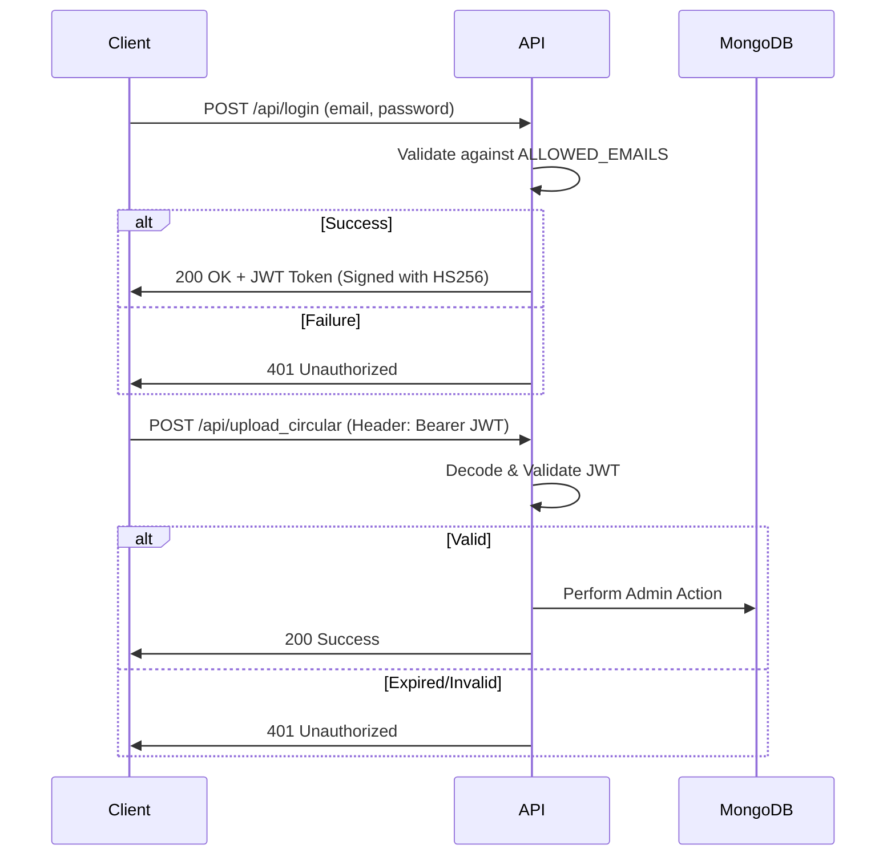
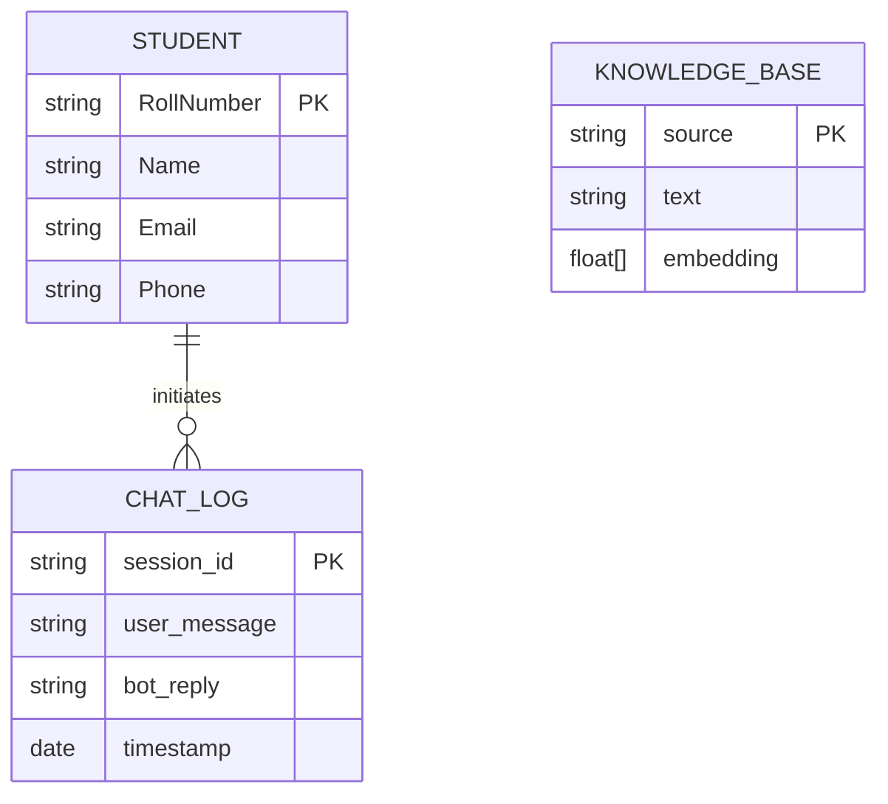

# 03 - API and Database Design

## 1. REST API Documentation

The backend exposes a comprehensive RESTful API. Below are the core endpoints.

### Authentication Endpoints
- `POST /api/login`
  - **Payload**: `{ "email": "admin@anits.edu.in", "password": "..." }`
  - **Response**: `{ "token": "jwt_string..." }`
  - **Purpose**: Authenticates administrators.

- `POST /api/faculty/login`
  - **Payload**: `{ "email": "faculty@anits.edu.in", "password": "..." }`
  - **Response**: `{ "token": "jwt_string..." }`
  - **Purpose**: Authenticates faculty members.

### Chat & Inference Endpoints
- `POST /chat`
  - **Payload**: 
    ```json
    {
      "message": "Explain this image",
      "session_id": "web_12345",
      "image": "data:image/jpeg;base64,...",
      "audio": null
    }
    ```
  - **Response**: `{ "reply": "This is a class schedule..." }`
  - **Purpose**: The core inference engine. Handles Text, Audio, and Image inputs.

### Admin Endpoints (Require JWT Header: `Authorization: Bearer <token>`)
- `GET /api/admin/student_fields`
  - **Response**: `["Roll Number", "Name", "Branch", "CGPA"]`
  - **Purpose**: Dynamically returns all keys present in the `students` collection.
- `POST /api/upload_student_data`
  - **Payload**: Multipart Form Data (CSV/XLSX file).
  - **Purpose**: Parses and upserts student records.

### Faculty Endpoints (Require Faculty JWT)
- `POST /api/faculty/email-broadcast`
  - **Payload**: `{ "subject": "Exam Postponed", "htmlContent": "<h1>Notice</h1>..." }`
  - **Purpose**: Uses `smtplib` to iterate through the student collection and send personalized emails.

## 2. Authentication Flow



## 3. Database Schema Design (MongoDB)

Since MongoDB is schema-less, these represent the *logical* structures enforced by the application layer.

### Collection: `chat_logs`
Stores conversation history for context retrieval and analytics.
```json
{
  "_id": "ObjectId",
  "session_id": "String (web_xxx or telegram_xxx)",
  "user_message": "String",
  "bot_reply": "String",
  "detected_language": "String (e.g., 'en', 'te', 'hi')",
  "timestamp": "ISODate"
}
```

### Collection: `students`
A highly dynamic collection. Columns can vary based on admin uploads.
```json
{
  "_id": "ObjectId",
  "Roll Number": "String (Primary Identifier)",
  "Name": "String",
  "Email": "String",
  "Phone": "String",
  "CGPA": "Number",
  "Attendance": "String"
  // ... Any other dynamically mapped fields
}
```

### Collection: `knowledge_base`
Stores the embedded vectors for the RAG pipeline.
```json
{
  "_id": "ObjectId",
  "text": "String (The raw chunk of text)",
  "embedding": "[Array of 768 Float Numbers]",
  "source": "String (Filename)",
  "type": "String (pdf/json/website)"
}
```

### ER Diagram (Logical)


