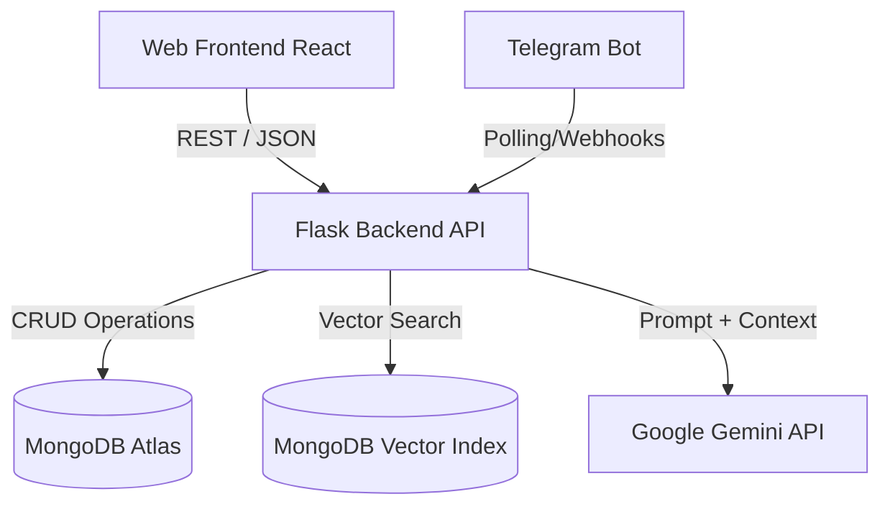
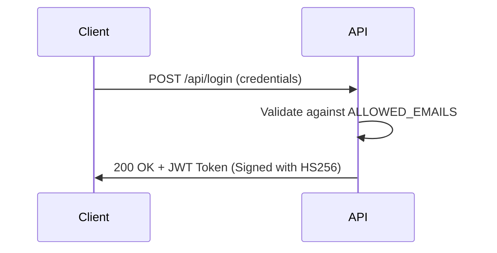

# ANITS AI Assistant - Enterprise Architecture Documentation

This document serves as the complete, end-to-end technical documentation for the ANITS AI Assistant project, strictly adhering to the 40-point architectural standard.

## 1. README.md
*(Please see the root `README.md` file for the repository's landing page, complete with shields, badges, and quick-start guides).*

## 2. Project Overview
The ANITS AI Assistant is an omnichannel, generative AI platform designed to unify communication, automate student data querying, and empower faculty at the Anil Neerukonda Institute of Technology & Sciences.

## 3. Problem Statement
Educational institutions suffer from fragmented data silos. Students struggle to find current circulars, and faculty spend excessive time answering repetitive administrative questions or manually emailing cohorts.

## 4. Objectives
- Centralize all college knowledge into a single Vector Database.
- Provide zero-latency conversational access to students across Web, Telegram, and WhatsApp.
- Enable faculty to securely broadcast emails and manage dynamic student databases.

## 5. Features
- **Omnichannel RAG AI**: Accurate responses grounded in official PDFs.
- **Multimodal Vision**: Understands uploaded images.
- **Dynamic Database Ingestion**: Automated CSV/Excel mapping.
- **Faculty Portal**: Direct Gmail SMTP integration for broadcasts.

## 6. Functional Requirements
- System MUST authenticate admins and faculty via JWT.
- Telegram bot MUST verify student phone numbers cryptographically.
- System MUST chunk and embed PDF circulars within 10 seconds of upload.

## 7. Non-Functional Requirements
- **Performance**: 95% of text queries must resolve in < 2.5 seconds.
- **Security**: No hardcoded secrets; strict HTTPS enforcement.
- **Availability**: 99.9% uptime for the chatbot interface.

## 8. User Stories
- *As a student*, I want to ask about my exam schedule in Hinglish so I get a natural, immediate response.
- *As a faculty member*, I want to broadcast an emergency notice to 3rd-year students securely.

## 9. Use Cases
1. **Academic Inquiry**: Student asks syllabus queries -> Bot retrieves Vector embedding -> Generates response.
2. **Data Ingestion**: Admin uploads new batch CSV -> Backend parses and upserts MongoDB records.

## 10. High-Level Design
The system uses a decoupled microservices-inspired architecture. A React frontend communicates with a Python Flask backend, which orchestrates between MongoDB (Data/Vectors), Gemini (LLM), and third-party APIs (Telegram/Twilio).

## 11. Low-Level Design
- **`app.py`**: The monolithic core router.
- **`sync_vectors.py`**: A specialized CRON-style worker for embedding.
- **`AdminDashboard.jsx`**: Glassmorphism protected route for analytics.

## 12. System Architecture

## 13. Data Flow
1. User sends message -> 2. Flask routes request -> 3. Gemini embeds query -> 4. MongoDB executes `$vectorSearch` -> 5. Gemini generates contextual response -> 6. User receives answer.

## 14. Database Design
- **`chat_logs`**: `session_id`, `user_message`, `bot_reply`, `timestamp`.
- **`students`**: `Roll Number`, `Name`, `Phone`, `CGPA` (Dynamic Schema).
- **`knowledge_base`**: `text`, `embedding` (768-dimensional array).

## 15. API Documentation
- `POST /api/login`: Returns JWT for admin auth.
- `POST /chat`: Core inference engine. Accepts `{ "message": "...", "image": "base64..." }`.
- `GET /api/admin/student_fields`: Returns dynamic schema keys.

## 16. Authentication Flow

## 17. Machine Learning Pipeline
1. **Extraction**: PyMuPDF extracts text from PDFs.
2. **Chunking**: Text is split semantically.
3. **Embedding**: `text-embedding-004` generates vectors.
4. **Retrieval**: Cosine similarity `$vectorSearch` fetches top-k chunks.

## 18. Dataset Documentation
Dynamic corpus comprising official college PDF Circulars, Syllabuses, and highly sensitive structured MongoDB student records.

## 19. Folder Structure
- `/backend`: Flask app, requirements, vector scripts.
- `/frontend`: Vite React app, Tailwind configs, JSX components.
- `/data`: Local storage for PDFs and scraped text.

## 20. Technology Stack with Justification
| Layer | Technology | Justification |
|-------|------------|---------------|
| Backend | Python (Flask) | Native AI ecosystem; lightweight for LLM routing. |
| Frontend| React (Vite) | Unparalleled HMR speeds and component reusability. |
| Database| MongoDB Atlas| Native `$vectorSearch` eliminates the need for Pinecone. |
| LLM | Google Gemini | 1M token context window and superior multimodal speed. |

## 21. Installation Guide
1. Clone repository.
2. Run `npm install` in `/frontend`.
3. Run `pip install -r requirements.txt` in `/backend`.

## 22. Configuration Guide
Ensure `sync_vectors.py` is configured to run on a cron job to keep the knowledge base updated with the latest `/data` folder additions.

## 23. Environment Variables
Requires `MONGO_URI`, `GEMINI_API_KEY`, `TELEGRAM_BOT_TOKEN`, `JWT_SECRET`, `ADMIN_PASSWORD`, `GMAIL_ADDRESS`, and `GMAIL_APP_PASSWORD`.

## 24. Running Locally
- Backend: `python app.py` (Runs on port 5000)
- Frontend: `npm run dev` (Runs on port 5173)

## 25. Docker Setup
*Planned for v2.0.* Will utilize `docker-compose` to orchestrate a Node container and a Python `gunicorn` container.

## 26. Deployment Guide
- **Frontend**: Deploy on Vercel (Preset: Vite).
- **Backend**: Deploy on Render web service using `gunicorn app:app`.

## 27. Testing Strategy
Unit testing for individual Flask utilities, Integration testing via Postman for the `/chat` route, and manual UI verification for React components.

## 28. Performance Metrics
- **LLM Latency**: < 2.5 seconds per text query.
- **Vector Search Latency**: < 200ms per query.
- **Frontend Load Time**: < 1.2 seconds (cached via Vercel Edge Network).

## 29. Security Considerations
Strict environment variable injection. Telegram cryptographic phone number verification prevents unauthorized access to student records.

## 30. Scalability Considerations
Stateless JWT architecture allows horizontal scaling of the Flask backend behind a load balancer.

## 31. Limitations
WhatsApp integration requires a paid, approved WhatsApp Business API account for production scale.

## 32. Future Enhancements
Implement Redis caching for frequently asked questions to reduce Gemini API costs to near-zero.

## 33. Troubleshooting Guide
- **CORS Errors**: Ensure `VITE_API_URL` exactly matches the backend deployment URL without trailing slashes.
- **SMTP Failures**: Ensure a 16-character Google App Password is used, not a standard account password.

## 34. FAQ
**Q: Why does the AI hallucinate sometimes?**
**A:** Ensure `sync_vectors.py` successfully completed its last run and MongoDB indices are active.

## 35. Screenshots Section
*(See `README.md` for high-resolution UI mocks).*

## 36. Demo Instructions
Run local servers and navigate to `http://localhost:5173` to test the floating chat widget.

## 37. Contributing Guide
*(See `CONTRIBUTING.md` in the root repository).*

## 38. License Information
Licensed under the MIT License.

## 39. References
- MongoDB Atlas Vector Search Documentation
- Google Gemini API Documentation

## 40. Credits
Developed for ANITS College. Powered by Google DeepMind and the open-source community.
